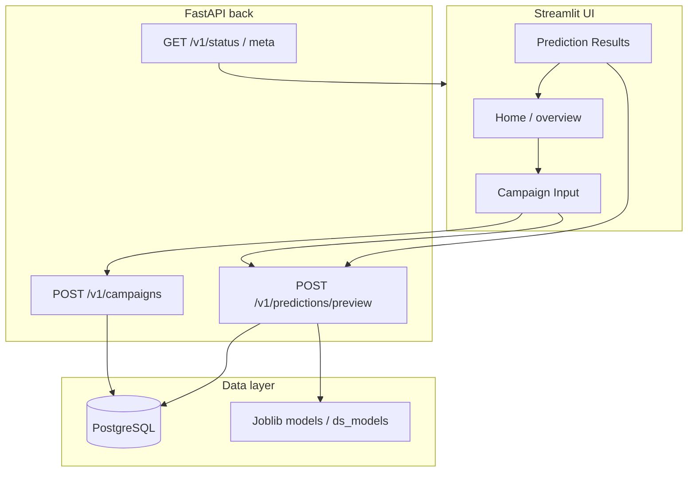

# DS 223 Marketing Analytics – Group Project Demo

- [Home](index.md) · [Project structure](project-structure.md) · [API](api.md) · [ETL notes](etl.md)

## Product Overview

**Product Name:** AdVise  
**Team Number:** 2  
**Demo Date:** May 14, 2026  

AdVise is an AI-powered marketing analytics platform that predicts the potential success of advertising campaigns before they go live. By analyzing creatives, audience details, campaign goals, and budget inputs, AdVise provides performance forecasts such as predicted CTR, conversion rate, engagement, and reach.

The platform helps marketers identify the strongest creatives, optimize campaign strategy early, and reduce wasted ad spend through data-driven insights and machine learning predictions.

---

## Problem Definition

Companies spend billions on digital ads every year, yet many campaigns fail because marketers often launch campaigns without knowing:

- if the creative is strong enough  
- if branding is consistent  
- if messaging fits the audience  
- if the landing page matches the ad  
- if the campaign follows current trends  
- which version will perform best  

As a result, companies waste advertising budget on weak campaigns.

**AdVise** addresses this by scoring campaigns early with ML tier predictions, structured audience and creative features, and a clear path from input → API → stored predictions.

---

## Solution Architecture

### User flow (high level)

**Microservice components**

- **Frontend:** Streamlit (`AdVise/app/`) — campaign form, preview, charts.  
- **Backend:** FastAPI (`AdVise/api/`) — `/v1` routes, Swagger `/docs`, optional Prefect-wrapped creative extraction.  
- **Database:** PostgreSQL — campaigns, ads, audience, predictions; offline `training_dataset` for training/enums.  
- **Models:** sklearn + joblib artifacts under `AdVise/ds/models` (mounted into the API for live preview tiers).  
- **Orchestration:** Prefect (API-side creative flow; optional repo-level flows under `scripts/` when configured).  
- **Documentation:** MkDocs site + this repo README.

---

## Team Roles

| Name | Role | Responsibility |
|------|------|------------------|
| Natali Minasyan | Project/Product Manager | Planning, roadmap, team coordination |
| Milena Sargsyan | Data Scientist | Data prep, modeling, evaluation |
| Hayk Gevorgyan | Backend Developer | API with FastAPI |
| Emilya Sepoyan | Database Developer | PostgreSQL setup, CRUD |
| Rita Chamiyan | Frontend Developer | Streamlit app |
| Nare Kechechyan | Orchestration | Prefect flows |

---

## Live Demo Flow

### 1. Introduction (by PM)

- Product and problem statement  
- MVP and roadmap  
- Architecture / user-flow diagram  

### 2. Frontend (by PM)

- Navigate through Streamlit UI  
- Visualizations, predictions, and user interaction  

### 3. Backend (by PM)

- FastAPI endpoints and Swagger UI  
- Data exchange flow with frontend/model  

### 4. Model (by PM)

- Model type, performance metrics  
- Example prediction output  

### 5. Database (by PM)

- Show schema design  
- Example data insert/query  

### Q&A Session

---

## Final Notes

- All components of the project have been integrated and tested during the live demo.
