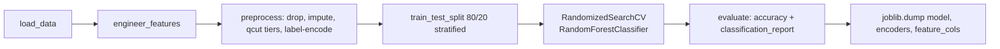
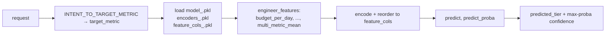

# Data Science — training, models, and live inference

The ML brain of AdVise. Three **Random-Forest tier classifiers** that predict whether a campaign will land in the `low`, `medium`, or `high` bucket on the metric chosen by the campaign's intent. The same artifacts are used in two modes:

1. **Live preview** — loaded by the FastAPI service to answer `POST /v1/predictions/preview`.
2. **Batch scoring** — run by `AdVise/ds/predict.py` to write `outputs/predictions.csv` and (optionally) update the `predictions` table.

Source: `AdVise/ds/`.

## Layout

```
AdVise/ds/
├── train.py                                      # Fit the three tier classifiers
├── predict.py                                    # Batch inference + optional DB write-back
├── modeling_related_files.py                     # Shared features, encoders, loaders
├── creative_extract.py                           # Image feature extraction helpers
├── Feature_extraction_automatation_pipelines.py  # Prefect flow for creative extraction → DB
├── generate_visuals.py                           # Offline charts for the Streamlit Results page
└── models/                                       # Joblib artifacts (mounted into API as /api/ds_models)
```

## The three trained models

`train.py` fits **one Random-Forest per target metric**. The list of targets lives in `modeling_related_files.TRAIN_TARGETS`:

```python
TRAIN_TARGETS = ["ctr", "conversion_rate", "reach_score"]
```

For each target the script saves three artifacts to `AdVise/ds/models/`:

| Target metric | Used for campaign intent | Classifier | Artifacts on disk | Size |
|---------------|--------------------------|------------|-------------------|------|
| **`ctr`** | `traffic`, `engagement` (default fallback) | `RandomForestClassifier` (sklearn) | `model_ctr.pkl`, `encoders_ctr.pkl`, `feature_cols_ctr.pkl` | ~526 MB / 4 KB / 335 B |
| **`conversion_rate`** | `sales`, `leads`, `conversion`, `lead_generation` | `RandomForestClassifier` | `model_conversion_rate.pkl`, `encoders_conversion_rate.pkl`, `feature_cols_conversion_rate.pkl` | ~26 MB / 4 KB / 335 B |
| **`reach_score`** | `awareness` | `RandomForestClassifier` | `model_reach_score.pkl`, `encoders_reach_score.pkl`, `feature_cols_reach_score.pkl` | ~343 MB / 4 KB / 335 B |

The three artifacts per target are deliberately split:

- **`model_<metric>.pkl`** — pickled `RandomForestClassifier`. Output labels: `low` / `medium` / `high`.
- **`encoders_<metric>.pkl`** — dict of `{column: LabelEncoder}` fitted on the training data. Re-used at inference to keep categorical encodings stable.
- **`feature_cols_<metric>.pkl`** — ordered list of feature names. Inference reorders incoming dataframes to exactly this order before calling `predict`.

### Legacy artifact

`models/model.pkl` (and the paired `encoders.pkl` / `feature_cols.pkl`) is an older single-target model kept for backwards compatibility. The API only falls back to it for `ctr` unless `ADVISE_LEGACY_MODEL_ONLY_FOR` is set. New consumers should use the per-metric files above.

## Intent → metric mapping

A single API preview returns **one** tier. The mapping that picks which model to load lives in `AdVise/api/campaign_intent.py` and is mirrored on the DS side in `modeling_related_files.INTENT_TO_TARGET`:

| Campaign intent | Target metric | Model file |
|-----------------|---------------|------------|
| `awareness` | `reach_score` | `model_reach_score.pkl` |
| `traffic`, `engagement` | `ctr` | `model_ctr.pkl` |
| `sales`, `leads`, `conversion`, `lead_generation` | `conversion_rate` | `model_conversion_rate.pkl` |
| unknown / other | `ctr` (default) | `model_ctr.pkl` |

## Features (21)

`modeling_related_files.FEATURE_COLS` is the **single source of truth** — `train.py` and the API inference path both go through it.

| Group | Features |
|-------|----------|
| **Campaign** | `platform`, `duration_days`, `campaign_intent`, `product_type`, `cta_type` |
| **Audience** | `age`, `gender`, `location`, `interests`, `audience_temperature`, `customer_type`, `career` |
| **Creative** | `creative_type`, `copy_text_length`, `aspect_ratio`, `visual_complexity`, `has_person` |
| **Derived (engineered)** | `engagement_per_day` = `engagement_score / (duration_days + 1)`, `budget_per_day` = `budget / (duration_days + 1)`, `copy_length_bucket` = `pd.cut(copy_text_length, [0, 10, 30, 9999])` → `short` / `medium` / `long`, `multi_metric_mean` = `lead_rate` (a no-leakage proxy) |

Columns dropped before training (`DROP_COLS`): `budget`, `is_synthetic`, `data_source`. `budget` is dropped because it's already captured by the more informative `budget_per_day`. Median-imputed (`IMPUTE_MEDIAN_COLS`): `engagement_score`.

## Training pipeline — `train.py`

End-to-end (one pass per target):



### 1. Data loading (`load_data`)

Tries Postgres first via `AdVise/etl/db/scripts/utils/db_helpers.get_connection`. The query joins `campaigns`, `audience`, `ads`, and `predictions` so the row count == number of campaigns with at least one prediction. If the DB isn't reachable, it falls back to `AdVise/etl/db/data_clean/training_dataset.csv` produced by the ETL job. See [Database ERD](erd.md) and the ETL section of [Orchestration](orchestration.md).

### 2. Feature engineering (`engineer_features`)

Adds `engagement_per_day`, `budget_per_day`, `copy_length_bucket`, `multi_metric_mean`. Same function is imported by `predict.py` and by the API's inference path, so train/serve skew is impossible by construction.

### 3. Preprocessing (`preprocess`)

For each target:

- **Drops bad rows** where `conversion_rate == 0` and `engagement_score` is NaN — incomplete synthetic rows that add noise.
- **Imputes** `engagement_score` with its median.
- **Drops metadata** columns (`budget`, `is_synthetic`, `data_source`).
- **Bins the target** with `pd.qcut(target, q=3, labels=["low", "medium", "high"])` → balanced tiers.
- **Drops the other target columns** from `X` (`ctr`, `conversion_rate`, `reach_score`, `engagement_score`, `lead_rate`) to prevent leakage.
- **Label-encodes** all categorical / object / bool / string columns. Encoders are saved per target.

### 4. Hyper-parameter search (`train`)

```python
RandomizedSearchCV(
    RandomForestClassifier(random_state=42, n_jobs=-1),
    param_distributions={
        "n_estimators":      [200, 300],
        "max_depth":         [15, 20, None],
        "min_samples_leaf":  [3, 5, 10],
        "max_features":      ["sqrt", "log2"],
        "class_weight":      ["balanced", None],
    },
    n_iter=8, cv=3, scoring="f1_macro", n_jobs=-1, random_state=42,
)
```

The best estimator is kept, evaluated on the 20% test split, and persisted.

### 5. Evaluation (`evaluate`)

Prints `accuracy_score` and `classification_report(y_test, preds)` per target. The console output during training is the canonical place to read model performance for that training run.

### Running it

```bash
# From AdVise/ds/. Tries DB; falls back to the CSV path.
python3 train.py

# Or with an explicit CSV
python3 train.py --data-path ../etl/db/data_clean/training_dataset.csv
```

Outputs land in `AdVise/ds/models/` as the artifacts in the table above.

## Live inference (called by the API)

`AdVise/api/prediction_models.py` reads the joblib triple for the resolved `target_metric` and produces the tier. The flow on a single `POST /v1/predictions/preview` call:



Engineered features (`engagement_per_day`, `budget_per_day`, `copy_length_bucket`, `multi_metric_mean`) are computed at request time when absent so the inference vector matches what `train.py` produced. Categorical values not seen during training are mapped to the encoder's first class (a safe default) instead of crashing.

**Confidence** = the max softmax probability across `low` / `medium` / `high`. It's the value returned as `prediction_confidence` on the API response.

## Batch scoring — `predict.py`

For offline runs and the Streamlit Results page's "performance segment" charts.

```bash
# From AdVise/ds/
python3 predict.py                                  # one target per row, based on campaign_intent
python3 predict.py --target ctr                     # force a single target
python3 predict.py --output-path outputs/preds.csv
```

What it does:

1. Loads from Postgres (joining the four live tables) or falls back to the cleaned CSV.
2. Runs `engineer_features`.
3. Either uses `--target` everywhere, or maps each row's `campaign_intent` to the right target through `INTENT_TO_TARGET`.
4. Loads `model_<target>.pkl` + `encoders_<target>.pkl` for each unique target.
5. Predicts class + max-proba confidence; adds a `performance_segment` column (`"Strong Performer — recommend launching"` / `"Average Performer — consider optimizing"` / `"Weak Performer — do not recommend"`).
6. Writes `outputs/predictions.csv` and (best-effort) `UPDATE predictions SET predicted_tier = …, confidence = …` for rows that have `campaign_id` + `predicted_metric`.

## Creative feature extraction (image-based)

`AdVise/ds/creative_extract.py` exposes `extract_creative_features(image_path)` — colour palette, aspect ratio bucket, person-detection heuristic, complexity, text length. Two places consume it:

| Caller | Mode |
|--------|------|
| API preview (`AdVise/api/creative_prefect.py`) | One image per request, executed inside the Prefect flow `api-creative-extraction-preview`. Used by `POST /v1/predictions/preview` when `creative_image_base64` is present. |
| DS batch flow (`Feature_extraction_automatation_pipelines.py`) | Iterates over `ads.creative_url`, writes results back into `ads` via `UPDATE`. |

See [Orchestration](orchestration.md) for the Prefect-level details (retries, deployments, work pool).

## Configuration

| Env var | Effect |
|---------|--------|
| `ADVISE_DS_MODELS` | Directory the API reads joblib artifacts from. Default `AdVise/api/ds_models`; in Compose `./AdVise/ds/models` is mounted read-only at `/api/ds_models`. |
| `ADVISE_LEGACY_MODEL_ONLY_FOR` | Limits which targets fall back to the legacy `model.pkl`. Unset = legacy is used only for `ctr`. |
| `DB_HOST` / `DB_*` from root `.env` | Reachability of Postgres for `train.py` / `predict.py` direct loads. |

## Version pinning

Joblib pickles are sensitive to scikit-learn version mismatches. Keep `AdVise/api/requirements.txt` and the environment used to run `train.py` aligned. If you see `InconsistentVersionWarning`, re-train from the **same** sklearn the API depends on (or pin both up).

## Related

- [API](api.md) for the endpoint that loads these models.
- [App](app.md) for how the predictions surface to the user.
- [Database ERD](erd.md) for the shape of `training_dataset` (training input) and `predictions` (output of batch + preview).
- [Orchestration](orchestration.md) for the creative-extraction flow and the DS batch Prefect flow.
