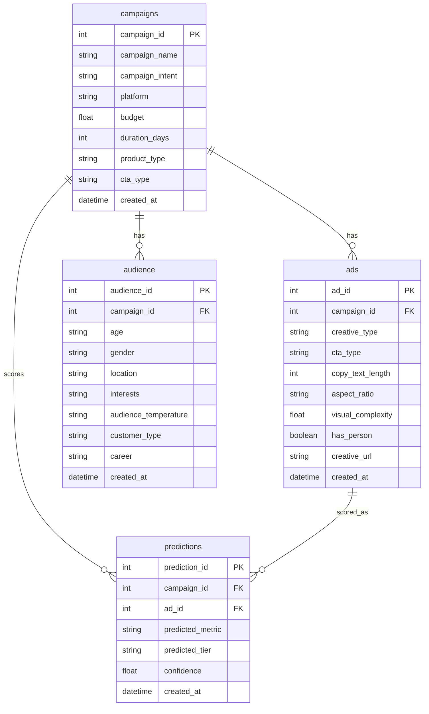
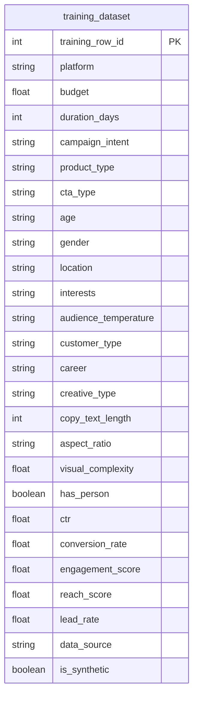

# Database ERD (live + training)

Entity-relationship view of tables in **`AdVise/etl/db/sql/schema.sql`**.

**Rendering the diagram:** In **MkDocs** (`mkdocs serve` / `mkdocs build`), the Mermaid block below should draw as a diagram when **`fence_code_format`** is set for the `mermaid` custom fence in **`mkdocs.yaml`** (see [Material: Diagrams](https://squidfunk.github.io/mkdocs-material/reference/diagrams/)). The **Cursor / VS Code Markdown preview** often shows Mermaid as a single line of code; use the **ASCII ERD** in that case, or open the built **`site/erd/index.html`** in a browser.

## ASCII ERD (always readable)

```text
  training_dataset          (no FKs — offline bulk training rows)
  ----------------

  campaigns 1 ---- * ads
      |
      +---- * audience
      |
      +---- * predictions *---- 1 ads   (predictions.ad_id -> ads)
      |
      UNIQUE (campaign_id, predicted_metric)  on predictions
```

## Mermaid (MkDocs / GitHub / mermaid.live)

Live app tables (first diagram). **`training_dataset`** is separate — no foreign keys to **`campaigns`**.



Offline **`training_dataset`** (wide fact table — attributes only):



## Constraints and rules (SQL)

| Object | Definition |
|--------|------------|
| **`uq_campaign_metric`** | `UNIQUE (campaign_id, predicted_metric)` on **`predictions`** — one stored score per campaign per target metric (preview upserts this row). |
| **`budget_positive`** | `CHECK (budget > 0)` on **`campaigns`**. |
| **`duration_positive`** | `CHECK (duration_days > 0)` on **`campaigns`**. |

## Indexes (non-PK)

`ads(campaign_id)`, `audience(campaign_id)`, `predictions(ad_id)`, `predictions(campaign_id)`, `campaigns(platform)`, `campaigns(campaign_intent)`, `ads(creative_type)`, `audience(location)`.

## Notes

- **`predictions.ad_id`** references **`ads`**; **`predictions.campaign_id`** references **`campaigns`**. The app ties a prediction to a single creative (`ad_id`) for the latest score on that metric.
- **`audience`**: the API currently creates one audience row per campaign; the schema allows more than one row per **`campaign_id`** unless you add a unique constraint.
- **`training_dataset`**: populated by **`load_to_db.py`** from the cleaned CSV; not joined to **`campaigns`** in the database.
